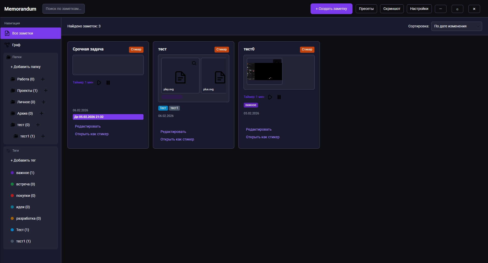
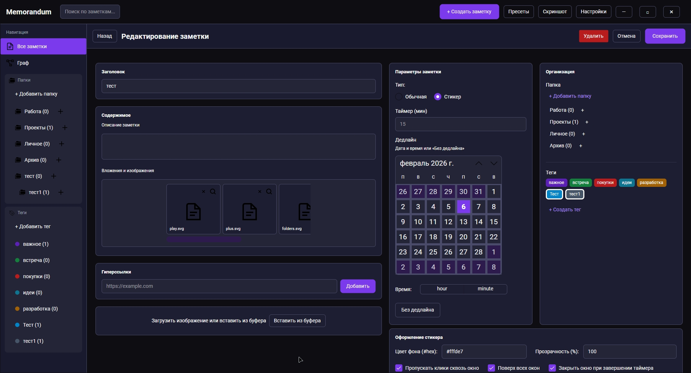
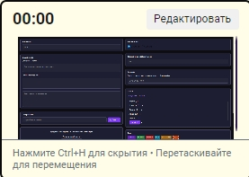
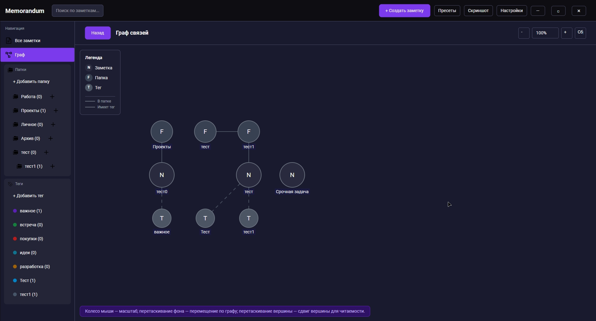
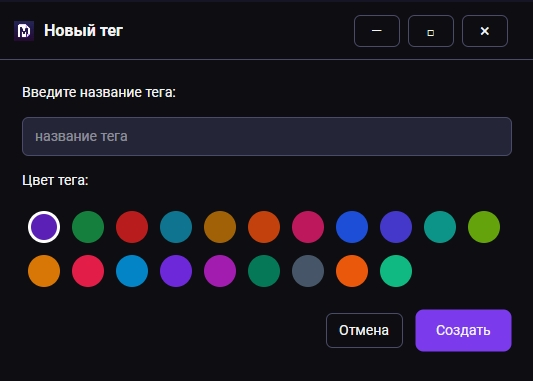
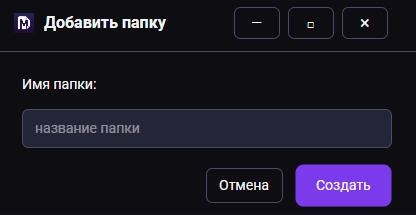
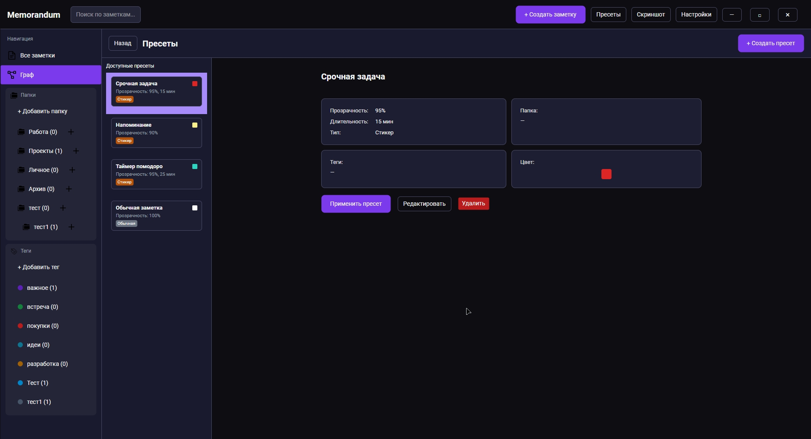
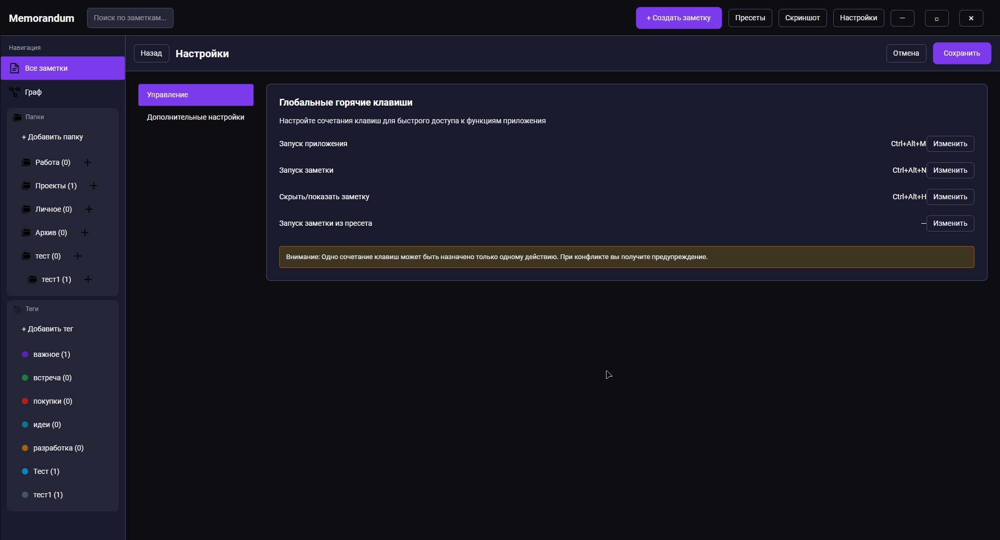

# Memorandum

**Приложение заметок, стикеров и графов**

**Автор:** MCREAPER  
**Стек:** Avalonia 11, .NET 8

---

## Скриншоты

### Главное окно



Список заметок с превью, сайдбар с папками и тегами, поле поиска в шапке. Тёмная тема (фиолетовый, чёрный, золотой), сортировка по дате или названию. Клик по заметке открывает редактор.

---

### Редактор заметки



Заголовок, полный текст, теги и папка. Блок дедлайна с календарём и выбором времени; напоминание показывается каждые 30 секунд. Вложения отображаются в контенте, можно открыть файл или изображение.

---

### Стикер



Окно стикера поверх всех окон: отображает заметку, таймер в минутах и звуковое уведомление по истечении. Кнопка «Редактировать» открывает содержимое в редакторе с сохранением обратно в заметку. Можно включить «пропускать клики» и настроить прозрачность.

---

### Граф заметок



Граф привязан к папкам: каждая заметка — вершина, связи задаются структурой. Вершины и фон можно перетаскивать. Легенда и подсказка поясняют типы узлов.

---

### Добавление тега



Создание и привязка тегов к заметкам. Теги отображаются в сайдбаре; фильтр по тегу или папке сужает список заметок.

---

### Вложения



Вставка файлов и изображений: из буфера обмена или перетаскиванием. В заметке хранятся как блоки `[Файл: path]` и `[Изображение: path]`; на карточке и в редакторе показывается превью, есть кнопка открытия вложения.

---

### Создание по пресету



Пресеты сохраняют набор настроек заметки (папка, теги, тип и т.д.). Из списка пресетов можно применить пресет к новой или существующей заметке; создание по пресету подставляет шаблон за один шаг.

---

### Настройки



Настраиваемые глобальные горячие клавиши (запуск приложения, список заметок, скрыть/показать, пресет) сохраняются в `hotkeys.json`. В настройках предусмотрены пункты для звука уведомлений, автозапуска и сворачивания в трей (логика дорабатывается).

---

## Описание

Memorandum — кроссплатформенное приложение для заметок с поддержкой стикеров поверх экрана, дедлайнов, тегов и папок, графа связей и глобальных горячих клавиш. Данные хранятся локально (JSON в `LocalApplicationData/Memorandum`).

---

## Реализовано

- **Интерфейс:** тёмная тема (фиолетовый, чёрный, золотой), шрифт Roboto, кастомные стили скроллбара, ComboBox, календаря; главное окно открывается развёрнутым на весь экран
- **Заметки:** заголовок, описание (превью), полный текст; теги, папки; типы «обычная» / «стикер»
- **Хранение:** `notes.json` и `hotkeys.json` в папке приложения (LocalApplicationData); загрузка при старте, сохранение при изменениях; модель с `Id`, `CreatedAt`, `LastEditedAt`
- **Стикеры:** окна поверх всех окон, прозрачность, «пропускать клики»; таймер (минуты), звук уведомления, закрытие по таймеру; редактирование с сохранением в заметку
- **Дедлайн:** дата/время в редакторе (календарь + TimePicker); отображение на карточке и в стикере; напоминание (окно каждые 30 сек)
- **Горячие клавиши:** настраиваемые глобальные сочетания (запуск, заметки, скрыть/показать, пресет)
- **Теги и папки:** иерархия в сайдбаре, фильтр по папке/тегу
- **Граф:** привязка к папкам, заметка = вершина; перетаскивание вершин и фона; легенда и подсказка
- **Пресеты заметок:** список, детали, создание, применение
- **Скриншот области:** выбор области, Win+Shift+S, буфер, тост
- **Вложения:** файлы и изображения; вставка из буфера, drag-and-drop; превью на карточке и в редакторе
- **Поиск:** по названию (содержит), подсветка и прокрутка к найденной заметке
- **Прочее:** перемещение окна за заголовок; закрытие главного окна завершает приложение; удаление заметки из редактора; несколько окон стикера для одной заметки

---

## В планах

- Подключить сортировку списка заметок (по дате изменения / дате создания / названию) к ComboBox в списке
- Настройки: звук уведомления (путь, громкость), автозапуск, сворачивание в трей — привязать к логике
- Резервное копирование: экспорт `notes.json` и `hotkeys.json` в выбранную папку
- Опционально: минимальное API для интеграции с TypeScript (при появлении задачи)

---

## Запуск

Сборка и запуск из корня решения:

```bash
dotnet run --project Memorandum.Desktop
```

---

## Структура

- **Memorandum.Desktop** — Avalonia-приложение (окна, представления, стили, сервисы персистентности, горячих клавиш, графа, контента и т.д.)
- Хранение: `INotesPersistenceService` / `NotesPersistenceService`, `NoteStorage`; конфиг горячих клавиш — отдельный сервис и `hotkeys.json`
